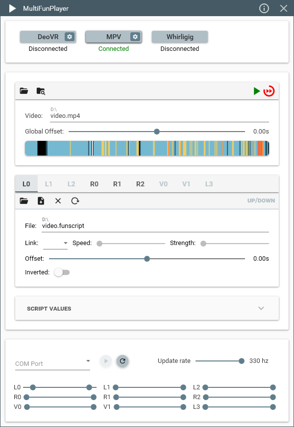

    <h1>MultiFunPlayer</h1>
     
    

 

# About

MultiFunPlayer synchronizes your devices with video files using scripts. The player has the ability to synchronize multiple devices with multiple scripts at the same time enabling enhanced experience.

# Downloads

* 
* 
* 

# Patreon only features

* Support for DeoVR SLR Interactive script streaming (requires SLR subscription)

# Main features

* Supports **[DeoVR](https://deovr.com/), [MPV](https://mpv.io/), [MPC-HC/BE](https://github.com/clsid2/mpc-hc), [HereSphere](https://store.steampowered.com/app/1234730/HereSphere/), [OpenFunscripter](https://github.com/OpenFunscripter/OFS), [VLC](https://videolan.org/vlc/), [PotPlayer](https://potplayer.daum.net/), [Whirligig](http://whirligig.xyz/), [Plex](https://plex.tv), [Emby](https://emby.media/) and [Jellyfin](https://jellyfin.org/)** video players
* Internal player to **play scripts without video files** 
* Supports **[buttplug.io](https://buttplug.io), TCP, UDP, websockets, namedpipes, serial, file and The Handy (experimental)** outputs
* Supports **[XBVR](https://github.com/xbapps/xbvr) and [Stash](https://github.com/stashapp/stash)** as script repositories
* **C# plugin system** for custom behaviours and integrations
* Supports **multiple concurrent outputs** of the same type
* Supports **TCode v0.2 and TCode v0.3** devices with advanced customization
* Auto detection and connection to any supported video player and output
* Flexible **keyboard/mouse/gamepad** shortcut system with many configurable actions
* Seek, open and play/pause video from MultiFunPlayer
* Real time **script smoothing** using pchip or makima interpolation
* Configurable per axis **speed limit** and **auto-home**
* **Smart limit** to limit axis range or speed based on another axis
* **Soft start sync** feature to prevent unwanted motion
* **Script libraries** to allow loading scripts not located next to the video file
* Ability to **link unscripted axes** to scripted axes
* Ability to **generate additional motion** or **fill script gaps** using random, script, pattern or custom curve motion providers
* Customizable **theme color** with **dark mode**
* **Script heatmap** with range and heat visualization
* Supports script **bookmarks and chapters**
* True **portable app**, no files are created/edited outside of the executable folder

# How To

To synchronize with videos:

* Add desired video player via the top-right "plus" button
* Configure if needed by expanding settings with the "arrow" button on the right side
* Click connect *(NOTE: DeoVR, Whirligig and HereSphere require you to enable remote server/control support in their settings)*
* Add desired output via the bottom-right "plus" button
* Configure by expanding settings with the "arrow" button on the right side
* Click connect

Once your video player and output are connected, scripts can be loaded in several ways:

* Manually, by dragging a script file from windows explorer and dropping it on the desired axis `File` text box.
* Manually, by using the `Script->Load` menu in the axis settings toolbar.
* Automatically, based on the currently played video file name if the scripts are named correctly:

Common

| Axis | Description | Valid file names |
|-|-|-|
| L0 | Up/Down | **`<video name>.funscript`** |
| L1 | Forward/Backward | **`<video name>.surge.funscript`**  |
| L2 | Left/Right | **`<video name>.sway.funscript`** |
| R0 | Twist | **`<video name>.twist.funscript`** |
| R1 | Roll | **`<video name>.roll.funscript`** |
| R2 | Pitch | **`<video name>.pitch.funscript`** |

TCode v0.2

| Axis | Description | Valid file names |
|-|-|-|
| V0 | Vibrate | **`<video name>.vib.funscript`** |
| V1 | Pump | **`<video name>.lube.funscript`** |
| L3 | Suction | **`<video name>.suck.funscript`** |

TCode v0.3

| Axis | Description | Valid file names |
|-|-|-|
| V0 | Vibrate | **`<video name>.vib.funscript`** |
| A0 | Valve | **`<video name>.valve.funscript`** |
| A1 | Suction | **`<video name>.suck.funscript`** |
| A2 | Lube | **`<video name>.lube.funscript`** |

 

> The above file names are standard and recommended, other supported script names can be seen and configured in "Device" settings.

> The above file names are matched in all script libraries and in the currently playing video directory.

# Prerequisites

* [.NET 8.0 x64 Desktop Runtime](https://dotnet.microsoft.com/en-us/download/dotnet/8.0/runtime)
* [Visual C++ 2019 x64 Redistributable](https://aka.ms/vs/17/release/vc_redist.x64.exe)

# Supporters

<table>
    <tbody>
        <tr>
            <td style="width: 250px"></td>
            <td style="min-width: 200px"><strong>Thank you to FUNOSR for providing me with their devices!   It will help ensure MultiFunPlayer behaves correctly with all device types.    If you don't have OSR2 or SR6 to use with MultiFunPlayer you can get one built for you with their custom low noise brushless servos via their <a href="https://www.aliexpress.com/store/1103361043/pages/all-items.html">shop</a>.</strong></td>
        </tr>
        <tr>
            <td></td>
            <td><strong>Thank you to all 200+ patreon members who allow me to dedicate more time to MultiFunPlayer!</strong></td>
        </tr>
    </tbody>
</table>