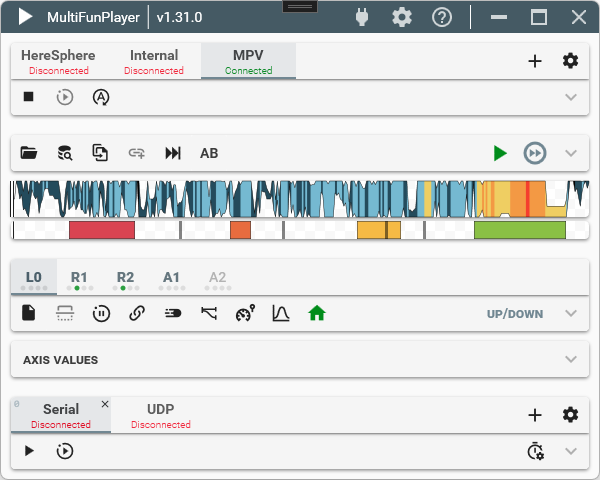

    <h1>MultiFunPlayer</h1>
     
    

 

# About

MultiFunPlayer is a simple app to synchronize your devices (e.g. [OSR](https://www.patreon.com/tempestvr) or [buttplug.io](https://buttplug.io) supported devices) with any video using funscripts. Supported video players are [DeoVR](https://deovr.com/), [MPV](https://mpv.io/), [HereSphere](https://store.steampowered.com/app/1234730/HereSphere/) and [Whirligig](http://whirligig.xyz/).
The player's main feature is the ability to play multiple funscripts at the same time, allowing for greater movement fidelity.

# Features

* One of the first multi axis funscript players
* Supports [DeoVR](https://deovr.com/), [MPV](https://mpv.io/), [HereSphere](https://store.steampowered.com/app/1234730/HereSphere/) and [Whirligig](http://whirligig.xyz/) video players
* Auto detection and connection to any supported running video player
* Real time script smoothing using pchip or makima interpolation
* Auto-home feature which when video is paused moves axis to its default value after some delay
* Supports local, DLNA, web and unc video paths
* Ability to output to [buttplug.io](https://buttplug.io), Network TCP/UDP, Namedpipes and Serial
* Soft start sync feature to prevent unwanted motion
* Script libraries to organize funscripts in different folders and load funscripts not located next to the video file
* Ability to link unscripted axis to a different one with optional random motion
* Smart limit on R1 (roll) and R2 (pitch) axes to limit values based on L0 (stroke) height
* Multi funscript heatmap
* True portable app, no files are created/edited outside of the executable folder

# How To

To synchronize with videos, start your desired video player and wait for automatic connection or click on the connect button to connect manually *(NOTE: DeoVR and Whirligig require you to enable remote support in their settings)*. Once connected, the funscripts can be loaded in several ways:

* Manually, by dragging a funscript file from windows explorer and dropping it on the desired axis `File` text box.
* Manually, by using the `Load script` button in the axis settings toolbar.
* Automatically, based on the currently played video file name if the funscripts are named correctly:

| Axis | Description | Valid file names |
|-|-|-|
| L0 | Up/Down | **`<video name>.funscript`**   `<video name>.stroke.funscript`   `<video name>.L0.funscript` |
| L1 | Forward/Backward | **`<video name>.sway.funscript`**   `<video name>.L1.funscript` |
| L2 | Left/Right | **`<video name>.surge.funscript`**   `<video name>.L2.funscript` |
| R0 | Twist | **`<video name>.twist.funscript`**   `<video name>.R0.funscript` |
| R1 | Roll | **`<video name>.roll.funscript`**   `<video name>.R1.funscript` |
| R2 | Pitch | **`<video name>.pitch.funscript`**   `<video name>.R2.funscript` |
| V0 | Vibrate | **`<video name>.vib.funscript`**   `<video name>.V0.funscript` |
| V1 | Pump | **`<video name>.lube.funscript`**   `<video name>.pump.funscript`   `<video name>.V1.funscript` |
| L3 | Suction | **`<video name>.suck.funscript`**   `<video name>.valve.funscript`   `<video name>.L3.funscript` |

> Names in **bold** are commonly used used and are preferred 

The above file names are matched in all script libraries and in the currently playing video directory.

# Requirements

* [.NET 5.0 Runtime](https://dotnet.microsoft.com/download/dotnet/current/runtime)